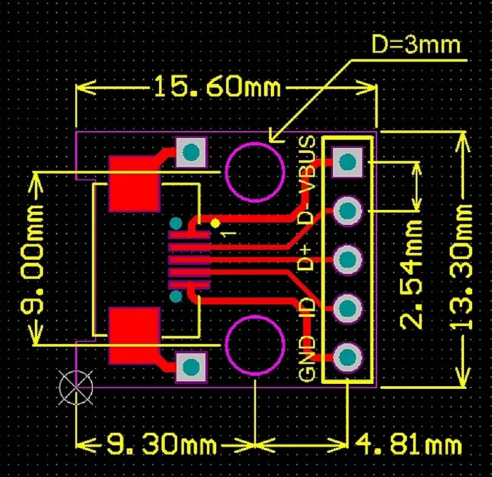
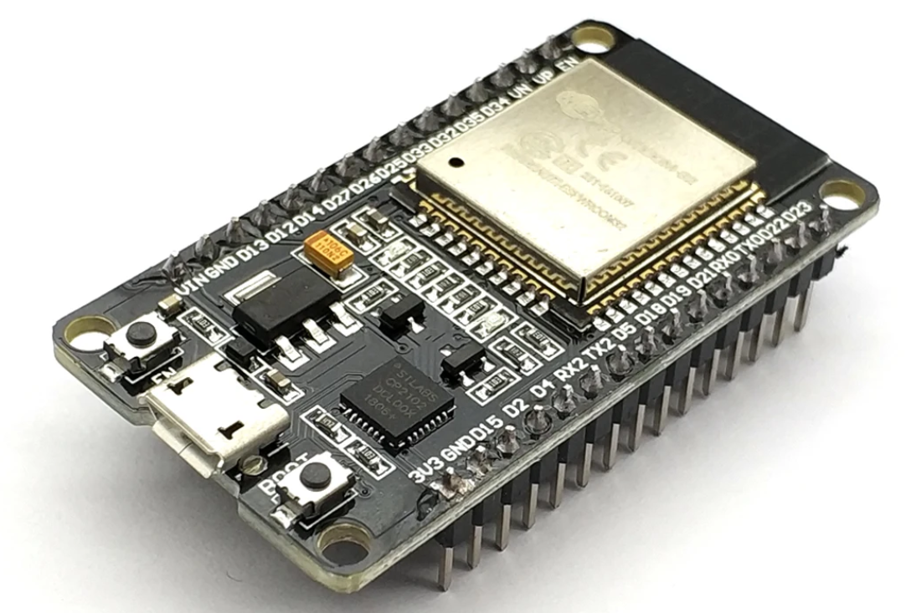

# Parts

* ESP32 DEVKIT V1
    - https://www.aliexpress.us/item/2255800094862861.html

* Micro USB Connector Breakout 

  - https://www.aliexpress.com/item/1005006088838882.html

* ±5% 100V 100nF -40℃~+110℃ Metallized Polyester Plugin,P=5mm

    - [C3034534](https://www.lcsc.com/product-detail/Film-Capacitors_KNSCHA-MEB104J100V82CB0018_C3034534.html)

* 47uF 50V ±20% 180mA@100kHz Plugin,D6.3xL12mm 

    - [C2831773](https://www.lcsc.com/product-detail/Aluminum-Electrolytic-Capacitors-Leaded_KNSCHA-03EC0571_C2831773.html)

* Metal Film Resistors 4.7kΩ 250mW ±100ppm/℃ ±1%
 
    - [C119339](https://www.lcsc.com/product-detail/Through-Hole-Resistors_CCO-Chian-Chia-Elec-MF1-4W-4-7K-1-T_C119339.html)

* Metal Film Resistors 47kΩ 250mW ±50ppm/℃ ±1%

    - [C410613](https://www.lcsc.com/product-detail/Through-Hole-Resistors_TyoHM-RN-1-4W-47K-F-T-B-A1_C410613.html)

* SN74HC14N Schmitt Trigger 6 21ns@6V,50pF 2uA 2V~6V DIP-14 Inverters ROHS

    - [C2907](https://www.lcsc.com/product-detail/Inverters_Texas-Instruments-SN74HC14N_C2907.html)


# Micro USB Breakout



# ESP32 DevKit V1




# Firmware

```bash
esptool.py --chip esp32 --port COM5 --baud 460800 --before default_reset --after hard_reset write_flash --flash_mode dio --flash_size detect --flash_freq 40m 0x1000 bootloader.bin 0x8000 partition-table.bin 0x10000 touchdro-diy-universal-1.6.bin
```


It seems that for the esp32 to broadcast you need to keep the boot 
button pressed


# References

- https://www.touchdro.com/resources/adapters/diy/esp32-diy-dro.html
- https://gitlab.com/VictorLamoine/kicad

https://www.touchdro.com/resources/adapters/diy/esp32-diy-dro.html


# Ordering from JLCPCB

## Step 1

from within `PCB`: 

- Export Gerber files
- Export Drill Files

- Export Placement file
  - Separate files for front/back
  - Keep only top file
  - Remove components not to be mounted

## Step 2 

from within `Schematic`:

Create BOM compatible with JLCPCB the custom plugin from within our `kicad-libs` projecs:


This plugin will include only the components with a `JLCPCB` attributes

# Production files

kicad_pos_to_cpl.py POSITION.POSITION-JLCPCB.csv overrides.json [overrides.json]

## Tune placement file

Example `overrides.json`:

```json
{
    "D3": 180,
    "Q1": 180,

    "U6": -90,
    "U8": -90
}
```
